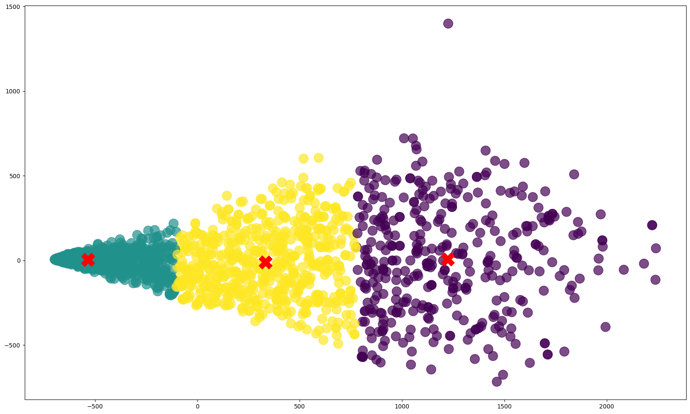

# **Customer Segmentation and Predictive Modeling: Unlocking Insights for Targeted Marketing**

This project focuses on customer segmentation using clustering algorithms to better understand customer behavior and tailor marketing strategies. By analyzing a retail dataset, we aim to segment customers into distinct groups based on their purchasing behavior and demographics.

## **Why Customer Segmentation Matters?**

Customer segmentation is a powerful tool that allows businesses to:
- **Tailor marketing strategies** by understanding different customer needs.
- **Personalize experiences** for various customer groups.
- **Improve retention and loyalty** by offering products and services that resonate with specific segments.


## Dataset Overview

The dataset used for this project consists of customer data with the following columns:

| Column Name           | Description |
|-----------------------|-------------|
| ID                    | Unique identifier for each customer |
| Year_Birth            | Year of birth of the customer |
| Education             | Education level of the customer (e.g., Graduation, PhD, Master) |
| Marital_Status        | Marital status of the customer (e.g., Single, Married, Divorced) |
| Income                | Annual income of the customer |
| Kidhome               | Number of children in the household |
| Teenhome              | Number of teenagers in the household |
| Dt_Customer           | Date the customer became a member |
| Recency               | Number of days since the customer’s last purchase |
| MntWines              | Amount spent on wine |
| MntFruits             | Amount spent on fruits |
| MntMeatProducts       | Amount spent on meat products |
| MntFishProducts       | Amount spent on fish products |
| MntSweetProducts      | Amount spent on sweet products |
| MntGoldProds          | Amount spent on gold products |
| NumDealsPurchases     | Number of purchases made with deals |
| NumWebPurchases       | Number of purchases made online |
| NumCatalogPurchases   | Number of purchases made via catalog |
| NumStorePurchases     | Number of purchases made in store |
| NumWebVisitsMonth     | Number of website visits per month |
| AcceptedCmp1 to 5     | Whether the customer accepted each of the five marketing campaigns |
| Complain              | Whether the customer complained about a product |
| Z_CostContact         | Cost to contact the customer |
| Z_Revenue             | Revenue generated from the customer |
| Response              | Response to the marketing campaign (0 = no, 1 = yes) |

## Clustering Results


The dataset was segmented into three distinct customer clusters based on their purchasing behavior and demographics. The following are the descriptions of each cluster:

### Cluster 1: **Premium Consumers** (Purple)
- **Description**: This cluster consists of individuals with higher incomes and older ages. They make more frequent purchases of premium consumer goods, especially in the food sector and luxury products such as gold. They are more active in purchasing goods offline (through stores).
- **Key Characteristics**: 
  - High-income
  - Frequent purchases of luxury goods
  - Active offline shoppers
- **Marketing Strategy**:
  - Focus on premium and luxury products, such as wine, high-quality meat products, or luxury goods such as gold jewelry.
  - Offer an exclusive and personalized shopping experience, for example, through personalized customer service or special events.
  - Consider offering exclusive deals to loyal customers in physical stores or through loyalty programs.

### Cluster 2: **Value Seekers** (Yellow)
- **Description**: This cluster consists of individuals with lower incomes and younger ages than Cluster 1. They tend to be more frugal in spending and make fewer premium purchases. Their purchases are mostly made online or through other more affordable channels.
- **Key Characteristics**:
  - Lower income
  - Prone to online shopping
  - More price-sensitive
- **Marketing Strategy**:
  - Focus on offering more affordable products with added value, such as big discounts or bundled packages.
  - Strengthen online sales channels, including promotions through e-commerce and digital campaigns that highlight price and value.
  - Provide special offers for younger customers, such as discounts or seasonal promotions that can attract their attention.

### Cluster 3: **Middle-Class Shoppers** (Green)
- **Description**: Individuals in Cluster 3 have higher incomes than Cluster 2, with slightly higher expenditures than Cluster 2 but lower than Cluster 1. They tend to be older and shop more frequently through multiple channels.
- **Key Characteristics**:
  - Moderate income
  - Balanced shopping habits (offline and online)
  - Middle-aged group
- **Marketing Strategy**:
  - Focus on products that provide a balance between quality and price, such as everyday necessities or products with affordable but premium brands.
  - Take advantage of multiple channels, both online and offline, with offers tailored to both in-store and online shopping.
  - Offer loyalty programs that can attract frequent shoppers, such as reward points for repeat purchases.
<br>
<br>

## Model Evaluation

In addition to clustering, we used classification algorithms to predict customer clusters. Here are the evaluation results for the models used:

### 1. **Logistic Regression**:
- **Accuracy**: 0.943
- **Precision**: 0.944
- **Recall**: 0.944
- **F1-Score**: 0.943

### 2. **Extra Trees**:
- **Accuracy**: 0.993
- **Precision**: 0.993
- **Recall**: 0.993
- **F1-Score**: 0.993

### 3. **Support Vector Machine (SVM)**:
- **Accuracy**: 0.998
- **Precision**: 0.998
- **Recall**: 0.998
- **F1-Score**: 0.998

As we can see, **SVM** achieved the highest performance across all metrics, followed by **Extra Trees** and **Logistic Regression**.


## Installation

To run this project locally, follow these steps:

1. Clone this repository:
    ```bash
    git clone https://github.com/yourusername/customer-segmentation.git
    ```

2. Install the necessary dependencies:
    ```bash
    pip install -r requirements.txt
    ```

3. Open and run the Jupyter notebook:
    - Launch Jupyter notebook:
      ```bash
      jupyter notebook
      ```
    - Open the `Customer_Segmentation.ipynb` notebook in your browser and execute the cells in sequence to preprocess the data, run clustering, and visualize the results.

Make sure you have Python 3.x installed.

## Dependencies
- pandas
- numpy
- scikit-learn
- matplotlib
- seaborn
- scipy
- plotly
- jupyter

## Usage

To use this notebook:

1. **Preprocessing**: Load and preprocess the dataset:
    - Open the `Customer_Segmentation.ipynb` notebook and run the cell responsible for data preprocessing.
    
2. **Running Clustering**: Execute the cell with the clustering code using K-Means Clustering.

3. **Visualizing the Results**: The final clusters will be visualized using various techniques like PCA and t-SNE

## Directory Structure

```bash
customer-segmentation/
│
├── Cluster-image.png
│
├── dataset/                     # Folder containing raw and processed datasets
│   └── Customer_Segmentation.csv
│   └── df_clustered.csv
├── notebooks/                   # Jupyter notebook for experimentation and analysis
│   └── Clustering_Customer-Segmentation.ipynb
│
├── requirements.txt             # List of required Python packages
│
├── README.md                    # Project overview and documentation
